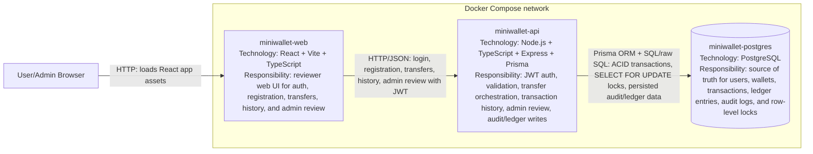

# MiniWallet Container Diagram

```mermaid
flowchart LR
  subgraph compose["Docker Compose network"]
    web["miniwallet-web\nTechnology: React + Vite + TypeScript\nResponsibility: reviewer web UI for auth, registration, transfers, history, and admin review"]
    api["miniwallet-api\nTechnology: Node.js + TypeScript + Express + Prisma\nResponsibility: JWT auth, validation, transfer orchestration, transaction history, admin review, audit/ledger writes"]
    db[("miniwallet-postgres\nTechnology: PostgreSQL\nResponsibility: source of truth for users, wallets, transactions, ledger entries, audit logs, and row-level locks")]
  end

  browser["User/Admin Browser"]

  browser -->|HTTP: loads React app assets| web
  web -->|HTTP/JSON: login, registration, transfers, history, admin review with JWT| api
  api -->|Prisma ORM + SQL/raw SQL: ACID transactions, SELECT FOR UPDATE locks, persisted audit/ledger data| db
```
