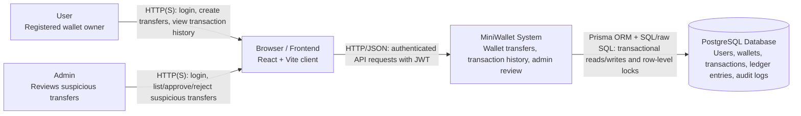

# MiniWallet Context Diagram

```mermaid
flowchart LR
  user["User\nRegistered wallet owner"]
  admin["Admin\nReviews suspicious transfers"]
  browser["Browser / Frontend\nReact + Vite client"]
  system["MiniWallet System\nWallet transfers, transaction history, admin review"]
  db[("PostgreSQL Database\nUsers, wallets, transactions, ledger entries, audit logs")]

  user -->|"HTTP(S): login, create transfers, view transaction history"| browser
  admin -->|"HTTP(S): login, list/approve/reject suspicious transfers"| browser
  browser -->|"HTTP/JSON: authenticated API requests with JWT"| system
  system -->|"Prisma ORM + SQL/raw SQL: transactional reads/writes and row-level locks"| db
```
